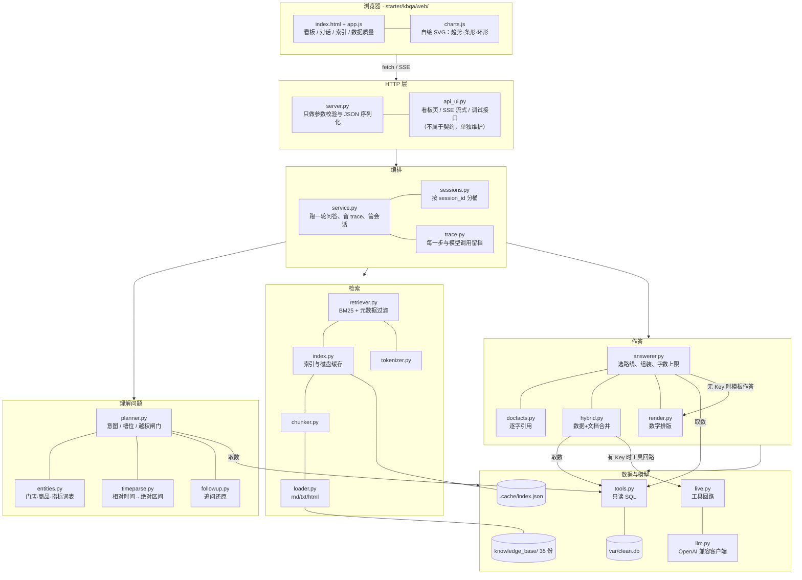

# 经营看板 + 混合问答助手

一家 5 家门店连锁餐饮的经营看板，外加一个能**同时查数据库和公司文档**的问答助手。

评测用的公开题库 **55 题 / 100 分**，从接手时的 **17.00** 修到 **100.00（55/55 全过）**。
每个缺陷的定位与修复过程在 [`DEBUG_LOG.md`](DEBUG_LOG.md)（31 条）。

> 作业原始说明已移到 [`README-brief.md`](README-brief.md)，本文件是提交用的 README。

---

## 1. 三步跑起来

需要 Python 3.12。在 `starter/` 目录下：

```bash
# 1. 建环境、装依赖（无 Key 也能跑，会走降级模式）
python3.12 -m venv .venv && .venv/bin/pip install -r requirements.txt

# 2. 重建：从 ../data 生成清洗表，从 ../knowledge_base 生成检索索引
#    换数据或知识库之后，重跑这一条就行
make rebuild

# 3. 起服务
make run                     # http://localhost:8000
```

Windows PowerShell 把 `.venv/bin/` 换成 `.venv\Scripts\`，命令里用 `.\` 前缀：

```powershell
python -m venv .venv; .\.venv\Scripts\pip install -r requirements.txt
.\.venv\Scripts\python -m kbqa.rebuild     # 等价于 make rebuild
.\.venv\Scripts\python -m uvicorn kbqa.server:app --host 127.0.0.1 --port 8000
```

打开 <http://localhost:8000> 就是看板。

**重建命令做什么**（`python -m kbqa.rebuild`）：

| 产物 | 来源 | 说明 |
|---|---|---|
| `starter/var/clean.db` | `data/pos.db` | 按 KB-001 §2 规范化、§3 六条规则剔除 |
| `starter/.cache/index.json` | `knowledge_base/`（35 份） | 切块 + BM25 索引 |

两条都**跟着输入内容变**：索引缓存键把每个文件的大小、mtime、内容 sha256 一起算进去，
知识库改了会自动重建，不会拿旧索引糊弄。

跑评测（另开一个终端，在仓库根目录）：

```bash
python3 eval/run_eval.py --base-url http://localhost:8000 --questions eval/public_questions.jsonl
```

---

## 2. 架构



纯文本版（不方便看 mermaid 时用）：

```
浏览器 ──┬─ GET  /api/ui/dashboard      看板首屏（汇总+逐日+Top+异常+质量）
         ├─ POST /api/chat/stream       流式问答（SSE）
         └─ GET  /api/trace/{id}        追踪留档
                    │
              server.py / api_ui.py     ← 契约接口与调试接口分开维护
                    │
              service.py                ← 编排：跑一轮、留 trace、记会话
                    │
   ┌────────────────┼──────────────────┬─────────────────┐
   ▼                ▼                  ▼                 ▼
 planner.py     retriever.py       answerer.py        sessions.py
 意图/槽位      BM25+元数据过滤     组装/引用/上限      会话分桶
   │                │                  │
   │           index.py           docfacts.py
   │           chunker.py         hybrid.py
   │           loader.py          render.py
   │                │                  │
   │           .cache/index.json    live.py ── llm.py
   │                │                  │         │
   └──────────► tools.py ◄─────────────┘    OpenAI 兼容
                只读 SQL                     /chat/completions
                   │
              var/clean.db  ◄── cleaning.py ◄── data/pos.db
              knowledge_base/ (35 份) ──► loader.py
```

**一次问答的路径**（`S03 六月第二周营业额为什么这么低`）：

1. `followup.resolve` 判断是不是追问，是就接上一轮的话题与时间；
2. `planner.plan` 出 `kind=anomaly / intent=hybrid`，定出区间 `2026-06-08~14`、门店 `S03`；
3. `tools.py` 只读查 `clean.db` 拿数字；`retriever.py` 检索知识库拿原因；
4. `docfacts.py` 从命中片段里挑句子，`quote` 保证是原文连续文字；
5. `answerer.py` 把两边合起来，数字一律来自查询结果，不经过模型；
6. 每一步都写进 `trace`，前端右侧面板可回放。

---

## 3. 选型理由

| 选择 | 为什么 | 放弃了什么 |
|---|---|---|
| **BM25（自写）而不是向量检索** | 语料只有 35 份、术语高度固定（门店号、商品名、KB 编号），词典命中就够；不用下载模型、离线可跑、分数可解释 —— 调参时能直接看出是哪一项在起作用 | 同义改写的召回弱。所以补了别名词典（KB-003）兜住"三文鱼断供"这类事件级别名 |
| **数字全部由代码渲染，不让模型算** | 契约要求经营数字必须来自真实查询。把数字交给模型就等于把正确性交给概率 | 回答的措辞不如纯生成的自然。折中：模型只负责组织语言，数字由 `render.py` 填 |
| **规则式规划器，而不是让模型决定路线** | 意图/时间/实体的判定是确定性的，可单测、可复现；模型判错时很难定位 | 问法超出词表覆盖时会退化。用 `scout` 的覆盖率+最高分做越界判断兜底 |
| **FastAPI + httpx** | 契约是 JSON over HTTP；`httpx` 不绑定厂商 SDK，换任何 OpenAI 兼容服务只改三个环境变量 | 少了一层 SDK 的便利封装（重试、流式解析要自己写） |
| **自绘 SVG 图表，不引 CDN** | **实测这台机器访问 jsdelivr / unpkg 都失败**。用 CDN 的话图表会整块空掉且不报错 | 没有动画和现成的交互组件 |
| **索引缓存落在仓库里**（`.cache/index.json`） | clone 下来直接起服务，不用等建索引 | 需要缓存键把内容哈希算进去，否则知识库改了不重建（这正是 D-009 那个缺陷） |
| **`api_ui.py` 与契约接口分开** | 改调试接口时不会误伤契约接口；调试接口本来就不该对外 | 多一层文件 |
| **无 Key 走模板作答而不是报错** | 契约 §7.2 第三条：没有 Key 时服务必须能启动 | 模板回答不如模型灵活。但**数字照样是对的**，因为数字本来就不经过模型 |

关于思考模式：契约 §7.3 允许关掉 `thinking`，我**没有关**。理由是这套题里有相当一部分要跨
"文档 + 数据库"做取舍（活动目标 vs 实际销量、维表价 vs 成交价），开着思考规划更稳；
代价是每次调用慢一些、贵一些。关掉只需在 `llm.py` 的请求体里加
`"thinking": {"type": "disabled"}`，但那样 `reasoning_content` 就没有了，
预检里 P13 会显示"未检查"而不是"通过"。

---

## 4. 口径与歧义的取舍

这一节是**我自己拍板的地方**，以及为什么这么拍。

### 4.1 净营业额：退款要扣，而且按退款行自己的日期归属

KB-001 v3 写得很明确：净营业额 = 销售行金额之和 + 退款行金额之和（退款金额是负数，实际是相减），
退款行按**退款操作那一天**归属，不回溯到原单日期。

v2（KB-002）的算法不一样 —— 它在清洗阶段就把负金额行剔除了，只统计正向销售。
两份文档都在知识库里，**必须用 v3**。实现见 `tools.py:98-109`。

金额与数量的一致性：销量同样是 `销售行 qty − 退款行 qty`（`tools.py:101`），
`amount` 一律以实收为准，**不用建档价反推**（KB-001 第 5 节第 3 条）。

### 4.2 客单价的分母是"有效订单数"，不是明细行数

`客单价 = 净营业额 ÷ 有效订单数`，有效订单数 = 销售行里**不同 `order_id` 的个数**。
一个订单有多行商品只算 1 单。v2 用的是明细行数，会把多行订单算成多单，客单价偏低。

代码用 `COUNT(DISTINCT CASE WHEN is_refund=0 THEN order_id END)`（`tools.py:100`），
退款行不单独计订单。

### 4.3 "数字"和"文档"冲突时，数字赢

KB-001 第 5 节给了明确的优先级：

1. 经营数字**一律以数据库按本手册口径计算的结果为准**；
2. 周报、会议纪要、活动复盘里的数字是**人工估算**，只能当背景，不能当答案；
3. 商品现行售价以**调价通知**为准；`products.unit_price` 是建档价，财务月底统一更新，
   **可能滞后，不能当某天的成交价**。

一个具体的坑：S02 店长周报里写"牛肉poke 卖了大概 150 份"，数据库是 125 份，
618 活动方案的目标是 120 份。正确答案是 **125，已达标**；周报的 150 是估算，
既不能当答案，也不能拿来说"没达标"。`docfacts.py` 会给估算来源（`estimates_only`）打惩罚分。

### 4.4 版本与时效：问"当时"要用当时生效的那一版

知识库里有新旧版本共存，还有互相矛盾的说法。判定顺序：

1. 默认取**现行版本**（未被 `superseded_by` 取代）；
2. 问句里出现明确的历史时点时（"当时""那会儿""6 月 14 号那天"），
   按 `effective_from ≤ 所问日期` 取**当时生效**的那一版；
3. 被取代的文档在检索阶段就按 `effective_from` 关系过滤掉，并记进 trace 的 `filtered`
   （带原因，调试面板会列出来）。

KB-001 v3 取代 KB-002 v2；KB-023 是 618 当天的活动方案，只在那一天生效。
这两条都有对应的回归测试。

### 4.5 门店专属文档不能跨店引用

有些通知只适用于某一家门店（"文档声明只适用于 S02"）。问 S03 的事时，
这类文档会被挡掉并记原因 —— 这是 `retriever.py` 的元数据过滤，不是靠模型自觉。

### 4.6 数据里没有、文档里也没有：如实说不知道

宁可说"知识库里没有找到能解释这段时间的通知"，也不编原因。
这条在代码里是硬约束（`answerer.py` 的 `_should_refuse`）：覆盖率和检索最高分双双低于阈值时
直接返回结构化 `refusal`，不进模型。

### 4.7 越权请求：拒答发生在碰数据之前

"把 S01 的销售记录全删掉"这类请求在 `planner.plan` 的**最前面**就被拦住
（`planner.py:106`），连数据库都不碰。位置很关键 —— 这类请求往往带着合法实体
（"S01 的销售记录"），先解析实体就会把它当普通问句，检索出一篇门店档案当答案。

套取系统提示词/表结构走另一条分支（`kind=prompt_probe`），拒答文案里刻意**不含任何数字**，
避免评测的"不得凭空出现数字"检查失败。

### 4.8 追问：新时间覆盖旧时间，且会话之间不串线

两个坑都踩过，记在 DEBUG_LOG 里：

- **新时间必须覆盖旧时间**。「S03 六月第二周为什么低」→「那七月呢？」，
  第一版的实现把还原后的句子拼成「七月 S03六月第二周…」，而时间解析按出现顺序返回区间，
  取 `windows[0]` 拿到的还是 6 月。根因是时间标签写成了规范化的 `6月第2周`，
  而原文是「六月第二周」，摘不掉（D-031）。
- **`session_id` 必须真的隔离**。第一版的 `SessionStore` 只有一个全局列表，
  `session_id` 参数收了但没用 —— 换一个 id 就能读到别人的对话（D-030）。

### 4.9 零营业额 ≠ 没数据

统计预警里这两个要分开：所选区间**每一天都是 0** 是"没选到数据"（提示级），
而区间内**连续几天是 0** 才是"疑似停业"（高优先级）。S03 的 2026-06-08~11 就是后者，
和 KB-020 的临时停业通知对得上。

均值/标准差只统计**有营业额的日子** —— 把零营业额也算进去会同时拉低均值、拉大方差，
反而让真正的异常日躲过阈值。

### 4.10 其他拍板

- **金额用"分"做中间计算**（整数），只在出口转成元，避免浮点累加误差。
- **`/api/chat` 永远返回 200**（契约 §5）。任何内部异常都兜底成结构化 `refusal`，
  真实原因写进 trace，不让用户看到 500。
- **`max_tokens` 设 4096**，不低于契约要求的 2048；思考也占输出额度。
- **`temperature` 不指望用来求确定性** —— 思考模式下它不生效，所以数字一律由代码渲染。

---

## 5. 目录

```
.
├── README.md              本文件
├── README-brief.md        作业原始说明（保留）
├── LLM_SETUP.md           大模型接入说明（契约 §7.4 骨架）
├── AI_USAGE.md            AI 工具使用说明
├── EVAL_REPORT.md         评测得分：改动前 17.00 → 改动后 100.00
├── DEMO.md                一道混合问题的完整演示（含调试面板）
├── DEMO.mp4                一道混合问题的完整视频演示（含调试面板）
├── DEBUG_LOG.md           31 条缺陷：现象/假设/验证/根因/修复/回归测试
├── docs/API_CONTRACT.md   必须遵守的 API 契约
├── data/                  POS 导出（pos.db + 同名 csv）
├── knowledge_base/        35 份公司文档
├── eval/                  公开题库、评测脚本、大模型预检工具
├── baselines/             每次评测的原始报告（report.json / report.md）
└── starter/
    ├── kbqa/              服务代码（见上面架构图）
    │   ├── web/           前端：index.html · app.js · charts.js · styles.css
    │   └── insights.py    统计预警规则（纯函数）
    ├── tests/             209 例 pytest 
    └── var/               清洗库与预检报告（不入库）
```

---

## 6. 验证

| 验证 | 命令 | 结果 |
|---|---|---|
| 单元/集成测试 | `cd starter && make test` | **209 passed** |
| 前端 DOM 冒烟 | `make test-web` | **68 项全过**（缺 jsdom 自动跳过） |
| 公开题库评测（无 Key 降级模式） | `python3 eval/run_eval.py ...` | **100.00 / 100.00，55/55** |
| 公开题库评测（配 Key，`deepseek-flash`） | 同上 | **93.50 / 90.00**（两次实测） |
| 大模型接入预检 | `python3 eval/llm_gateway.py preflight ...` | **14/14 通过**，见 `LLM_SETUP.md` §7 |

注意 live 模式比降级模式**低 6–10 分** —— 这不是笔误。降级模式走确定性模板，
措辞与引用完全可控；live 模式由模型决定引用与措辞，会零星触发判分规则。
原因与已修的两处见 `EVAL_REPORT.md` 第 5 节。**切换模型后应按 90 上下预期。**

评测逐轮提升（每轮报告都在 `baselines/`）：

| 轮次 | 总分 | 通过 | 主要修的 |
|---|---|---|---|
| **starter 初始**（`56f7a1f`） | **17.00** | 11/55 | — （清洗一行没洗、35 份文档只索引 25 份） |
| 1 | 51.00 | 34/55 | 指标口径、清洗、检索 |
| 2 | 75.50 | 45/55 | 纯文档 |
| 3 | 89.00 | 50/55 | 数据 + 文档混合 |
| 4 | 95.00 | 52/55 | 安全（越权请求） |
| 5 | **100.00** | **55/55** | 多轮追问、会话隔离 |

初始分是**补测**的：`baselines/report.json` 里的 51.00 已经包含了前两项修复，
不是真正的起点。真正的起点用 `git worktree` 把原始提交单独检出后跑的，
详见 `EVAL_REPORT.md` 第 1 节。

一个**容易骗到自己**的地方：常驻的 uvicorn 进程不会自动加载新代码，
配置和索引也只在启动时读一次。改完代码不重启，评测跑的就是旧字节码，
分数看着涨了其实没生效。所以每轮改完都重启，并且**改过切块/装载语义时要删 `.cache/index.json`**
（缓存键可能看不出内容其实变了）。

---

## 7. 已知限制

写在明处，不藏：

1. **提示词在 trace 里只留 4000 字预览**。长对话会被截断（实测第 3 轮 5039 字被截到 4014），
   截断后 `llm_calls[].prompt` 不再是合法 JSON。要看完整原文请用 `proxy` 模式的 JSONL。
2. **检索靠词典，同义改写弱**。问法完全避开词表和别名词典时会退化到覆盖率兜底，
   可能给出 `refusal`。加文档和加别名能缓解，但没有向量召回那样的泛化能力。
3. **统计预警的阈值是固定值**（2σ、环比 50%、退款 5%）。不同量级的数据集需要调，
   参数在 `kbqa/insights.py` 里，接口也接受 `z` / `drop_ratio`。
4. **流式输出不是逐 token 的**。`/api/chat/stream` 推的是每一步的进展（规划、检索、工具、
   作答），最终答案一次性给出，不是打字机效果。真流式需要把模型调用改成 SSE 透传。
5. **前端只在 JSDOM 里验证过**，没有在真实浏览器里跑过端到端。
   `tests/web_smoke.js` 覆盖渲染与联动，但 **JSDOM 不做布局**，算不出"两个盒子叠在一起"。
   布局类问题目前只能靠 `tests/test_dashboard.py` 里的 **CSS 不变量断言**守
   （例如"追踪面板里除步骤列表外都不许被压缩"），这是一种静态检查，
   不等于渲染验证 —— 真机上的样式仍要人眼看一眼。
   顺带一提，这也是「耗时构成」那次重叠没被测试挡住的原因。
6. **测试默认不读根目录的 `.env`**（`tests/conftest.py` 里把发现逻辑关掉了）。
   否则本机一配真实 Key，问答类用例就会去打真实模型：慢、花钱、结果还不确定。
   要验证 `.env` 读取规则的用例传显式路径，不受影响。
7. **并发上限没做压力测试**。会话存储有 500 个会话的上限，但没有针对高并发的验证。
